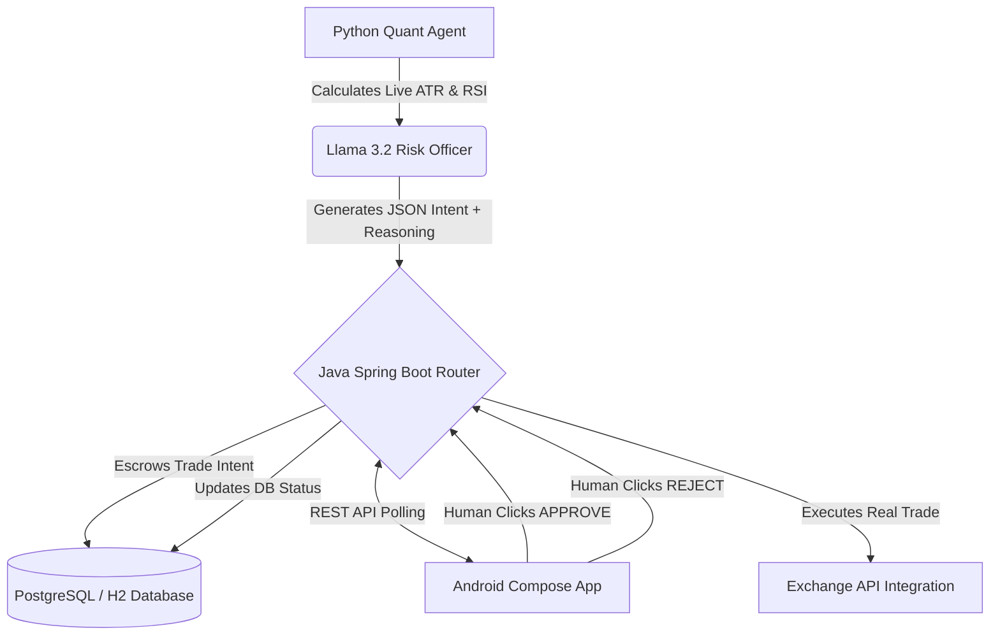

AgentRouter: Human-in-the-Loop Quant AI

Tagline: Algorithmic trading bots catch falling knives. AgentRouter doesn't.

AgentRouter is an enterprise-grade, distributed microservice architecture that combines the raw mathematical power of Quantitative AI with the intuitive risk-management of a Human-in-the-loop Portfolio Manager.

The Problem: "The Falling Knife"

During our extensive backtesting of over 20,000 candles on Binance, we discovered a fatal flaw in fully autonomous trading algorithms: They cannot read global panic. When a market flash-crashes, pure mathematical indicators (like RSI) will signal an "Oversold Buy". Autonomous bots will blindly buy the dip, get stopped out, and buy the dip again, draining the portfolio.

The Solution: Asymmetric Risk & Human Oversight

AgentRouter solves this by stripping the AI of its execution privileges and forcing it to act as an advisory "Risk Officer."

Dynamic ATR Volatility: The Python Quantitative Engine calculates the Average True Range (ATR) in real-time, creating dynamic Stop Losses that widen during high volatility and tighten during consolidation.

LLM Reasoning: Llama 3.2 interprets the math and packages it into a human-readable "Trade Intent".

The Escrow Router: A Spring Boot backend catches the AI's proposal and places it in a "PENDING" escrow state.

Human-in-the-Loop: The Portfolio Manager receives a real-time push to their Android Dashboard, reviews the AI's reasoning, and clicks APPROVE or REJECT based on macro-economic news.

System Architecture

Tech Stack

AI & Quant Engine: Python, Pandas, yfinance, Llama 3.2 (via Ollama/Groq)

Risk Router Backend: Java 17, Spring Boot, Spring Data JPA, Hibernate

Mobile Dashboard: Kotlin, Android Jetpack Compose, Retrofit, Coroutines

Project Demo Flow

The Problem

Autonomous trading bots are incredibly fast, but they have one fatal flaw: they catch falling knives. In my backtesting, I realized that during a flash crash, a pure math bot will blindly buy the dip over and over, draining a portfolio. I built AgentRouter to fix this by introducing Institutional Volatility Modeling and a Human in the Loop.

The AI Agent & Backend

The system starts with a Python Quantitative Engine. Rather than just relying on simple moving averages, it calculates the dynamic Average True Range (ATR) of the market in real time. It passes this strict math to a local Llama 3.2 model, which packages a trade proposal with a dynamic Stop Loss. However, the AI cannot execute it directly. Instead, it sends the proposal to My Spring Boot Risk Router, which holds the trade in Escrow.

The Android App & Human Oversight

This is where the human element takes control. As a Portfolio Manager, the user receives the AI's proposal on a native Android dashboard built with Kotlin and Jetpack Compose. The manager can see the live Profit and Loss, the dynamic Stop Loss, and the AI's exact reasoning. If the manager is aware of adverse market news (like a flash crash), they can simply click REJECT, saving the portfolio from an algorithmic trap. If the market setup looks safe, they click APPROVE, and Spring Boot executes the live trade.

The Vision

By combining real-time machine learning, robust Java microservices, and mobile human oversight, AgentRouter doesn't just make trades, it actively manages risk. It bridges the gap between pure quantitative speed and human intuition.
